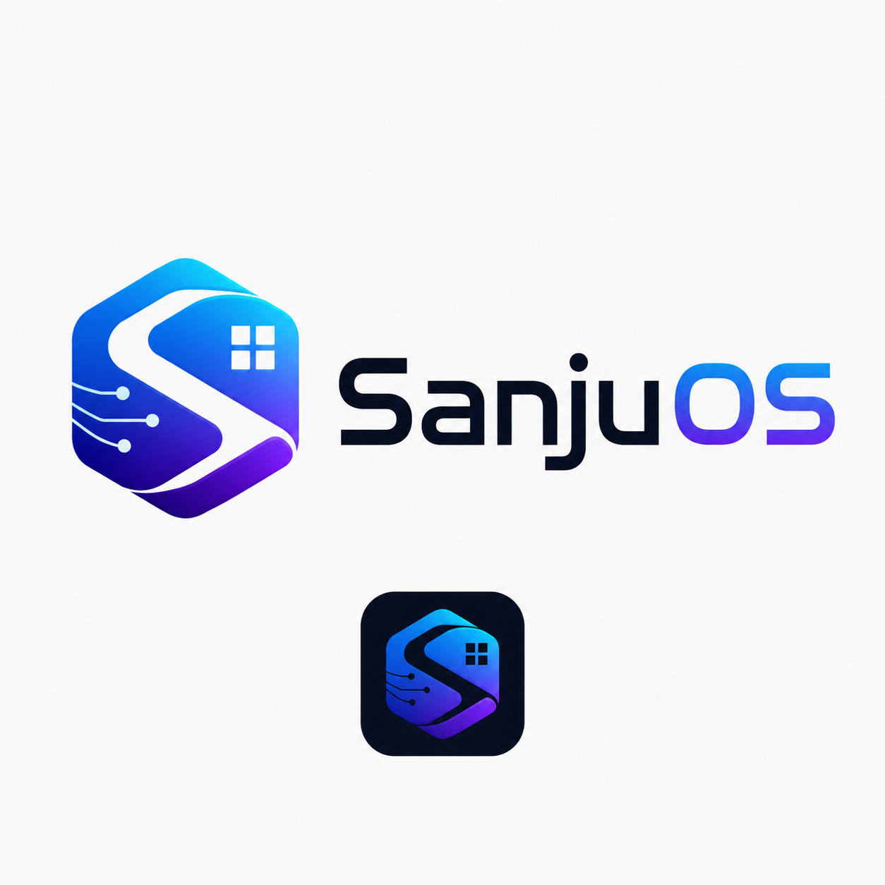

# SanjuOS



SanjuOS is an independent, Rust-first desktop operating-system project. It is not a Linux distribution. Development proceeds through emulator-verified kernel milestones before any physical-disk work.

## Current checkpoint: M5-alpha — Protected Userspace and Startup

M1 through M4 are QEMU-verified. The M5 major batch adds:

- active x86-64 CR3 capture and four-level paging policy;
- map/unmap bookkeeping, page flags, W^X checks, and guard-stack descriptors;
- boot-service memory reclaim accounting;
- a reusable first-fit kernel heap;
- Ring 3 GDT selectors and real `IRETQ` user entry;
- an x86-64 `SYSCALL`/`SYSRET` path;
- user-pointer validation and syscall ABI models;
- process control blocks, address-space objects, and quantum scheduling evidence;
- an allocation-free ELF64 PIE loader;
- embedded `init`, `hello`, and fault-isolation programs;
- user page-fault recovery without stopping the kernel;
- branded startup stages, failure codes, ASCII SanjuOS output, and the approved graphical logo asset;
- a single QEMU acceptance flow for the complete batch.

Expected smoke output includes:

```text
SanjuOS M5 boot transition
init: SanjuOS protected userspace online
hello: running from SanjuOS Ring 3
SanjuOS: isolated user exception
Ring 3 execution: active
System-call interface: active
ELF64 loader: active
User fault isolation: passed
SanjuOS logo print: active
M5 protected user-space gate: passed
SanjuOS kernel shell ready.
```

## Shell commands

```text
help version userspace uptime memory irq tasks ls cat write echo clear
```

## Build and verify

```bash
make setup
make user-programs
make source-check
make fmt
make lint
make test
make smoke
```

## Repository map

```text
boot/uefi/          UEFI entry, CPU tables, IRQs, Ring 3, syscalls, serial
kernel/             Core models, paging, heap, processes, ELF, shell, RAMFS
user/programs/      Position-independent Ring 3 assembly programs
assets/branding/    Approved SanjuOS graphical logo
scripts/            Build, image, QEMU, source-check, and test automation
docs/               Requirements, architecture, ADRs, testing, security, process
```

## M5 boundary

M5-alpha proves the first privilege transition, syscall, ELF, and user-fault paths. It does not yet provide a production security boundary: private hardware page-table roots and full register-context preemption remain later hardening work.

## Safety

M5-alpha remains emulator-only. Do not install it on a physical disk.
